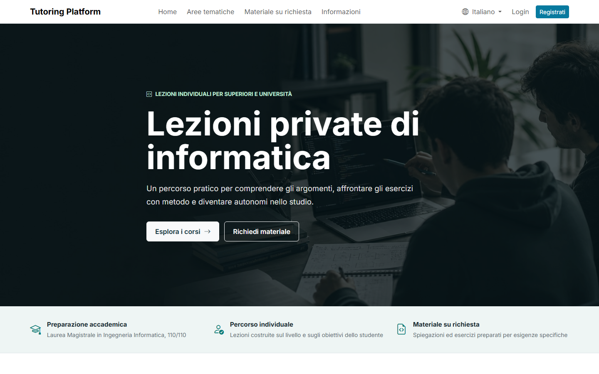
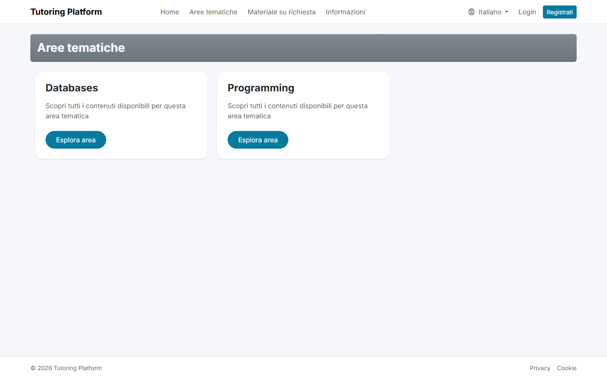
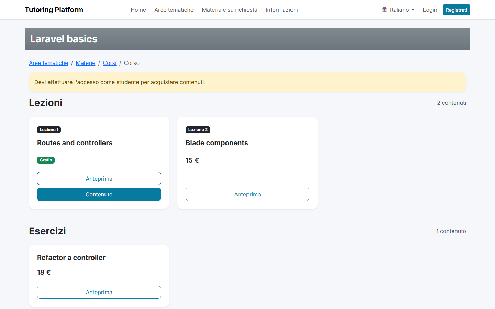
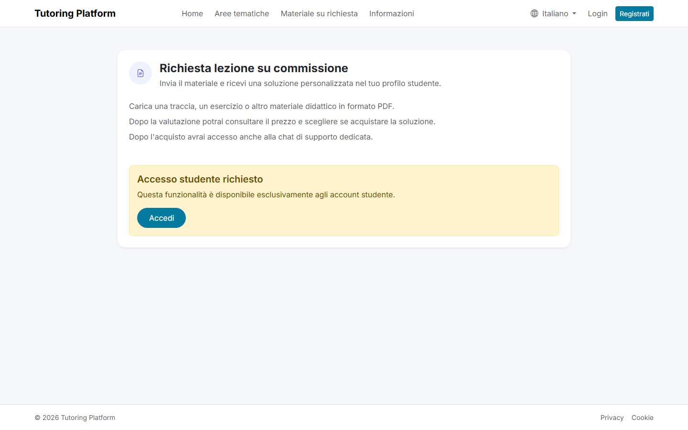

# Tutoring Platform

[](https://github.com/marchese89/tutoring-platform/actions/workflows/ci.yml)
[](https://github.com/marchese89/tutoring-platform/actions/workflows/docker-image.yml)


A portfolio-ready Laravel application for selling educational content and
managing the complete tutoring workflow: courses, lessons, exercises, custom
requests, payments, invoices, private files, and student support.



## Product Tour

The screenshots below use the demo data generated by the application seeders.

| Course catalog | Course content |
| --- | --- |
| [](docs/screenshots/catalog.png) | [](docs/screenshots/course-details.png) |

### Custom Material Requests

Students can submit a PDF with an exercise or topic, receive a priced custom
solution, purchase it, and continue the discussion through a dedicated support
chat.

[](docs/screenshots/custom-request.png)

## What the Application Covers

### Public experience

- Browse topic areas, subjects, courses, lessons, and exercises.
- Preview available educational material.
- Request a custom lesson or exercise solution.
- Switch between Italian and English.

### Student area

- Purchase lessons, exercises, and custom solutions through Stripe.
- Access purchased PDFs through authorized private routes.
- Review orders and generated invoices.
- Manage profile, address, email, and password.
- Exchange support messages related to purchased content.

### Administration area

- Manage the teaching catalog and its uploaded documents.
- Review custom requests, upload solutions, and assign prices.
- Monitor students, orders, sales, invoices, and support chats.
- Manage the tutor profile, certificates, billing data, and account settings.

## Technical Highlights

- Server-side Stripe verification before order creation or content access.
- Role middleware and authorization policies for student and admin resources.
- Private storage for paid content and student documents.
- Validated uploads with replacement and pruning workflows.
- Transaction-safe invoice number sequencing and PDF generation.
- Private broadcast channels and Laravel Reverb support for realtime chat.
- Reusable Blade components for forms, tables, cards, uploads, and empty states.
- Italian and English localization across pages, emails, validation, and invoices.
- Automated tests for payments, authorization, protected files, invoices,
  uploads, localization, factories, routes, and primary page flows.
- Separate development and production Docker configurations.

## Tech Stack

| Area | Technology |
| --- | --- |
| Backend | Laravel 12, PHP 8.2+ |
| Frontend | Blade, Bootstrap, JavaScript |
| Database | MySQL or MariaDB |
| Test database | SQLite in memory |
| Payments | Stripe |
| Realtime | Laravel Reverb |
| Documents | DOMPDF and protected PDF storage |
| Automation | PHPUnit, Laravel Pint, Composer Audit, GitHub Actions |

## Quick Start with Docker

Docker is the recommended way to run the complete demo environment. It starts
the Laravel application, MySQL, and Laravel Reverb.

```bash
git clone https://github.com/marchese89/tutoring-platform.git
cd tutoring-platform
docker compose up --build -d
```

On the first start, the application generates and persists an application key,
runs the migrations, and seeds the demo data when the users table is empty.

Open:

- Application: `http://localhost:8000`
- Reverb WebSocket server: `http://localhost:8080`

Useful commands:

```bash
docker compose ps
docker compose logs -f app
docker compose run --rm test
```

Stop the services while preserving data:

```bash
docker compose down
```

Remove all Docker-managed application and database data:

```bash
docker compose down -v
```

The host ports may be changed with `APP_PORT` and `REVERB_PUBLIC_PORT`.
Automatic demo seeding may be disabled with
`DOCKER_SEED_DATABASE=false`.

## Demo Accounts

| Role | Email | Password |
| --- | --- | --- |
| Admin | `admin@example.com` | `password` |
| Student | `student@example.com` | `password` |
| Student | `student2@example.com` | `password` |

These credentials are intended only for local demonstration environments.

## Local Installation

### Requirements

- PHP 8.2 or newer
- Composer
- MySQL or MariaDB

Required PHP extensions:

- `bcmath`
- `ctype`
- `curl`
- `dom`
- `fileinfo`
- `gd`
- `mbstring`
- `openssl`
- `pdo_mysql`
- `pdo_sqlite`
- `sqlite3`
- `tokenizer`
- `xml`
- `zip`

The `intl` extension is not required by the current setup.

On Windows, use `php --ini` to locate the active configuration file and
`php -m` to verify enabled extensions.

### Setup

```bash
git clone https://github.com/marchese89/tutoring-platform.git
cd tutoring-platform
composer install
cp .env.example .env
php artisan key:generate
```

Configure the database and service credentials in `.env`, then run:

```bash
php artisan migrate:fresh --seed
php artisan storage:link
```

The seed command creates a complete demo catalog, users, orders, invoices,
lesson requests, reviews, PDFs, and support chats.

The demo credentials can be changed before seeding through the
`SEED_ADMIN_*`, `SEED_STUDENT_*`, and `SEED_STUDENT_2_*` variables.

## Testing and Quality Checks

The test suite uses SQLite in memory and does not require a MySQL testing
database.

```bash
php artisan test
```

Run the complete local verification sequence before opening a pull request:

```bash
composer validate --strict
vendor/bin/pint --test
php artisan test
composer audit --locked --no-interaction
```

The same checks run automatically through GitHub Actions. CI also builds the
development image, runs the tests inside Docker, and validates the production
image.

## Payments

Stripe keys must be configured in `.env`.

Payment completion is verified server-side before the application creates an
order or invoice, or grants access to purchased content.

## Realtime Chat

Set `BROADCAST_CONNECTION=reverb` in `.env`, keep the `REVERB_*` application
and server values aligned, then start the WebSocket server:

```bash
php artisan reverb:start
```

The example environment uses port `8080`. With the log broadcast driver, the
application remains usable without a WebSocket server, but messages do not
update in real time.

## Production Docker Deployment

`compose.production.yaml` is a production-oriented baseline. It:

- builds the image without development and testing dependencies;
- uses an external or managed MySQL database;
- requires application, database, mail, Reverb, and payment secrets;
- disables demo seeding and automatic migrations;
- runs with `APP_ENV=production`, `APP_DEBUG=false`, and stderr logging.

Create the deployment environment file:

```bash
cp .env.production.example .env.production
```

Generate an application key and set it as `APP_KEY`:

```bash
docker run --rm php:8.3-cli php -r "echo 'base64:'.base64_encode(random_bytes(32)).PHP_EOL;"
```

Fill in the environment values, then build the image and run migrations
explicitly:

```bash
docker compose --env-file .env.production -f compose.production.yaml build
docker compose --env-file .env.production -f compose.production.yaml run --rm app php artisan migrate --force
docker compose --env-file .env.production -f compose.production.yaml up -d
```

Production does not create demo users. The first administrator must be created
through an explicit deployment procedure with a securely hashed password.

Pushes to `master`, version tags, and manual workflow runs publish the
production image to GitHub Container Registry as
`ghcr.io/<owner>/<repository>`.

Set `APP_IMAGE` in `.env.production` when deploying a prebuilt release.

## Additional Documentation

- [Refactoring roadmap](docs/REFACTORING_ROADMAP.md)
- [Release checklist](docs/RELEASE_CHECKLIST.md)

## Project Status

The core application is functional and maintained as a technical portfolio
project. The main security, payment, authorization, private-file, localization,
testing, Docker, and deployment refactoring work has been completed.
